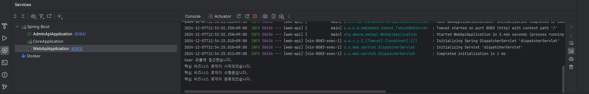
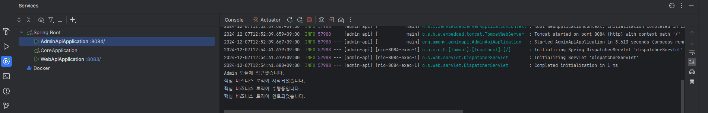

```text
이전에 몇 번 멀티모듈 프로젝트로 구성된 환경에서 일한 적이 있었고,
이번에는 MSA 환경에서 일해보게 되었다.
간단하게라도 멀티모듈을 직접 구축해보며 추후 더 잘 활용하고자 작성한다.
(경험했던 환경은 maven이었으나, 편의상 gradle로 작성했다.)

현재 내가 가진 멀티모듈의 개념은 공통 모듈을 분리하여, 의존성 주입하는 것이다.
장점은 중복을 제거하고 유지보수성을 높일 수 있지만,
단점으로는 빌드 및 배포 시간이 길어질 수 있다는 점이다.

앞으로 더 공부하면서 추가해나가고자 한다..

- 개요
  1) 구조
            ┌  web-api
     root  ─┼   core
            └ admin-api
     root 프로젝트 안에 세 모듈이 있고,
     web-api 및 admin-api 모듈이 core 모듈에 의존하는 구조다(하단 결과 참고).
  2) 소스
     루트 프로젝트는 하위 모듈 관리만 담당하므로 src 폴더를 삭제한다.
     settings.gradle 파일*에 하위 모듈들을 연결한다(include).
     반면 build.gradle 파일**은 모든 모듈에 존재해야 한다.
     * 각1
     만약 루트 프로젝트에 settings.gradle 파일이 없다면
     gradle은 해당 프로젝트가 멀티 모듈이라고 인식하지 못한다.
     추가로 하위 모듈의 settings.gradle 파일을 삭제해도 문제 없다.
     ** 각2
     루트 프로젝트의 build.gradle에 모두 세팅할 수도 있고,
     각 모듈에 따로 세팅해줘도 된다.
  3) 기록
    A. tasks.register("prepareKotlinBuildScriptModel"){}
       최초 프로젝트 빌드시 하단과 같은 에러가 떠서 각 build.gradle에 위를 추가했다.
       A problem occurred evaluating root project 'web-api'.
       > Project with path ':core' could not be found in root project 'web-api'.
    B. web-api(혹은 admin-api)에서 core 모듈의 빈을 사용하기 위해 다음을 추가했다.
       @ComponentScan(basePackages = {"org.among.webapi", "org.among.core"})
    C. 하위 모듈에서 또 다른 하위 모듈을 추가할 때는 루트 경로로부터 추가해야 하므로 :를 붙여야 한다.
       implementation project(':core')
    core 모듈의 경우 실행이 불필요하기 때문에 @SpringBootApplication.. bootJar.enable..
    D. core 모듈의 의존성은 컴파일 시에만 포함되도록 작성한다.
       compileOnly project(':core') // 컴파일시에만 core 모듈 의존
    E. 

  4) TODO
    A. build.gradle 구성 다시 해보기(루트 프로젝트에 모두 설정, 하위 모듈에 각각 설정)
    B. core 모듈의 경우 실행이 불필요하기 때문에 실행부 제거 필요
  
  5) 참고
    - https://umbum.dev/1177/

* MSA와의 차이


```

실행 결과는 다음과 같다.



